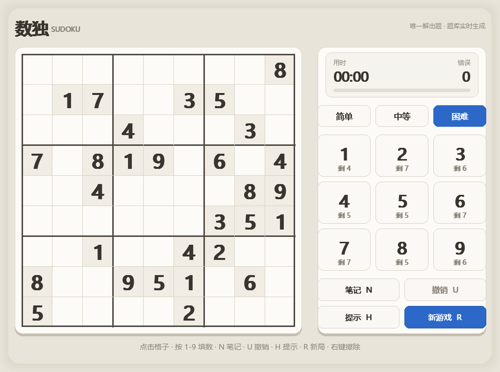
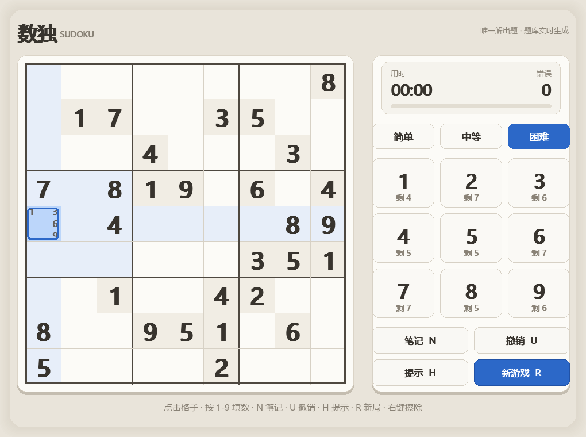
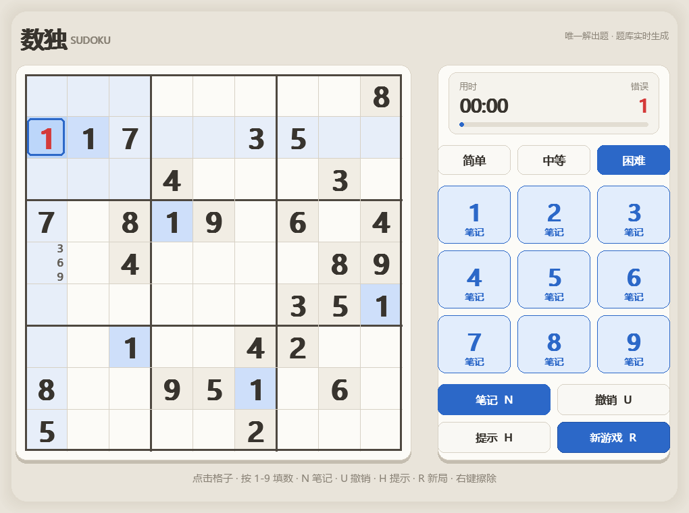
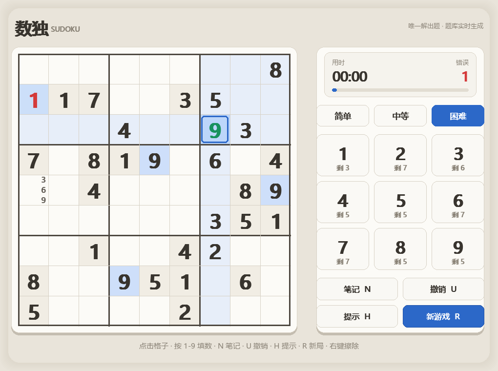
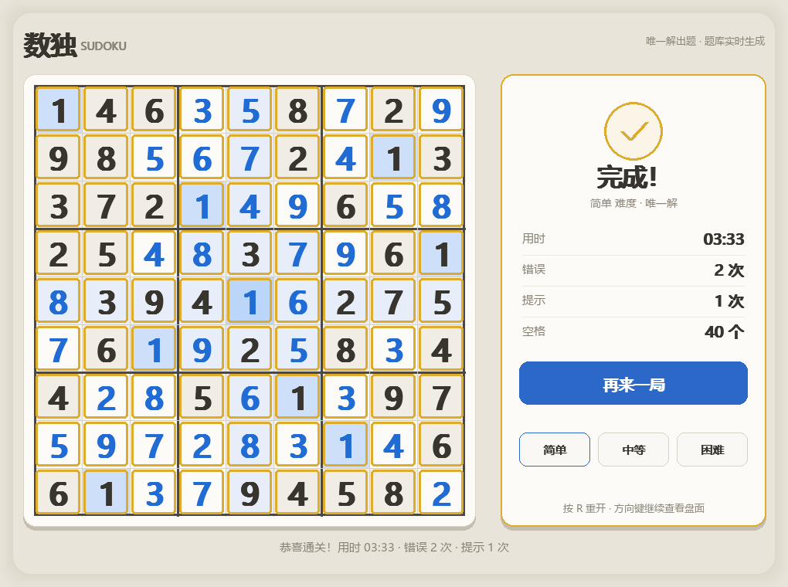
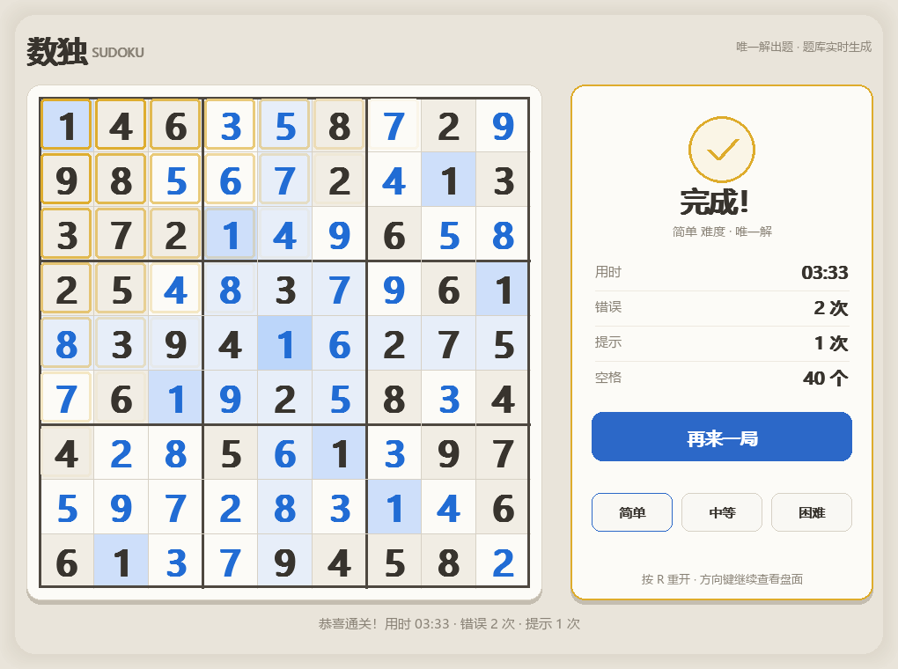

# 数独 Sudoku

一个用 pygame 写的数独。单文件、**零外部素材** —— 棋盘、格子、高亮、动画全部由代码实时绘制，音效由 numpy 现场合成（没有 numpy 就自动静音），clone 下来就能跑。


## 预览

| 开局 | 笔记模式 | 填错 + 笔记模式 |
| :---: | :---: | :---: |
|  |  |  |

| 提示 | 通关 | 通关动画 |
| :---: | :---: | :---: |
|  |  |  |

## 跨平台中文字体

界面中文在 Windows / macOS / Linux 上都能正常显示。程序按「平台常见字体路径 → fontconfig 族名 → SysFont」逐级探测，**每一级都做字形校验**（渲染几个不同汉字比对位图），只有真的画得出汉字才会采用。

> 这一步不是多余的：pygame 的 `match_font` 会给出「名字沾边、其实没有汉字」的字体（实测 `dejavusans`、`arial` 都会命中 Arial Narrow），一旦采用，界面就会静默变成一屏方框。真的找不到中文字体时，程序会明确提示装字体（`sudo apt install fonts-noto-cjk`），而不是假装正常。自检里配了正反两条断言防止回归。

## 快速开始

```bash
git clone https://github.com/201634924cyh/sudoku.git
cd sudoku
```

然后选一种方式启动：

| 平台 | 命令 |
| --- | --- |
| Windows | 双击 `run.bat` |
| macOS / Linux | `sh run.sh` |
| 任意平台手动 | `pip install -r requirements.txt` 然后 `python sudoku.py` |

启动脚本会自己找 Python、缺 pygame 就自动装（走腾讯云镜像（失败自动回退官方源）），首次运行不会卡住。

> 没有官方 pygame wheel 的 Python 版本（如 3.14）会自动改装 `pygame-ce` —— 社区分支，API 兼容，装完同样是 `import pygame`。

## 玩法

| 操作 | 说明 |
| --- | --- |
| 鼠标左键 | 选格；同行、同列、同宫和**相同数字自动高亮** |
| 数字键 `1`-`9` | 填数；填入时会同步清除同行列宫的同数字候选 |
| `N` / `空格` | 切换笔记模式（右侧数字键整排变蓝提示） |
| `U` / `Ctrl+Z` | 撤销，连自动清掉的候选数一起还原 |
| `H` | 提示：填一个正确答案，单独计数、不计错误 |
| `0` / `Del` / `Backspace` / `E` | 擦除当前格 |
| 鼠标右键 | 快速擦除该格 |
| `R` | 换一局 |
| 方向键 | 移动选择 |
| `Esc` | 退出 |

几个专门做过的细节：

- **数字键盘上标着每个数字还剩几个**，填满 9 个自动置灰，不再响应点击。
- **填错会标红并让棋盘抖动一下**，错误计数单独统计。
- 填入时**再按同一个数字等于取消**（但错误计数不回退）。
- 窗口可以任意拉伸：内部是固定逻辑画布（1020×760），按等比缩放呈现，鼠标坐标会反缩放回逻辑坐标。

## 出题算法

三道关卡共用一套「先造终盘、再挖洞」的流程：

| 步骤 | 函数 | 做法 |
| --- | --- | --- |
| 1. 造终盘 | `generate_full()` | 随机化回溯填满 81 格 |
| 2. 挖洞 | `make_puzzle()` | 打乱格子顺序，逐格尝试清空 |
| 3. 验唯一解 | `has_unique_solution()` → `solve_count()` | 回溯计数，**数到 2 就提前退出**，不关心具体有几解 |

关键在第三步：每挖掉一个数都要确认剩余题面**仍然只有唯一解**，否则这个洞就填回去。这样出的题保证不需要猜。

`solve_count(grid, limit=2)` 的 `limit` 参数是性能关键 —— 只判断「是否唯一」时，解到第 2 个解就可以收工，省掉大量无用的搜索。

三档难度只差挖洞数量：

| 难度 | 空洞数 | 生成耗时 |
| --- | --- | --- |
| 简单 | 40 | ~8 ms |
| 中等 | 46 | ~8 ms |
| 困难 | 52 | ~8 ms |

耗时足够低，所以**开局是同步生成的**，不需要异步线程或者加载动画。

## 自检

```bash
python selftest.py
```

用 `SDL_VIDEODRIVER=dummy` 起虚拟显示，跑 **914 条断言**（聚合成 34 组结论），覆盖：

- **出题正确性**：40 个随机终盘逐一验合法性与唯一解；三档难度各生成 6 次，断言空洞数稳定、题面是终盘的子集。
- **端到端通关**：用一个**不偷看答案**的约束推理求解器，走**真实鼠标键盘事件**打通困难局 52 步，断言 `mistakes` 全程为 0、通关后所有输入失效、计时停止。
- **缩放正确性**：1×、2×、瘦高、宽扁四种窗口下各点多次格子，确认反缩放落点没错位。
- **状态机**：题面给定格不可改、错误计错与标记、重复按键取消、笔记互不干扰、撤销恢复笔记与自动清理、空撤销栈安全。
- **渲染**：五种状态（empty / selected / notes / wrong / won）各绘制一遍，断言文字不越界、无暗像素残留。
- **性能**：update+draw 1.92 ms，最坏组合 4.05 ms/帧（约 247 FPS 上限），单帧未超 60 FPS 预算。

加 `--shots` 会在 `preview/` 下重新生成 README 用的这批截图：

```bash
python selftest.py --shots
```

游戏本身也支持三个命令行参数，方便脚本化验证：

```bash
python sudoku.py --diff hard      # 启动即用困难难度（easy / medium / hard）
python sudoku.py --frames 300     # 跑 300 帧后自动退出
python sudoku.py --seed 42        # 固定随机种子，复现同一局
```

## 项目结构

```
sudoku/
├── sudoku.py          # 游戏本体：出题、求解器、渲染、状态机、音效（单文件）
├── selftest.py        # 无窗口自检，914 条断言
├── run.bat            # Windows 启动脚本
├── run.sh             # macOS / Linux 启动脚本
├── requirements.txt   # 依赖（pygame 必需，numpy 可选）
├── preview/           # README 用的截图
├── LICENSE
├── .gitignore
└── .gitattributes
```

## 想改造的话，改这几个地方

| 想改什么 | 改哪里 |
| --- | --- |
| 难度档位与空洞数 | `DIFFICULTIES` 常量（现为 40 / 46 / 52） |
| 格子大小 / 棋盘尺寸 | `CELL`；`LOGICAL_W`、`LOGICAL_H` 是整体画布 |
| 配色 | 一组 `C_*` 与 `CELL_*` 常量（`CARD`、`CELL_SEL`、`CELL_PEER`、`CELL_SAME`…） |
| 候选数小字的样式 | `_draw_notes()` 里的字体字号与颜色 |
| 数字键盘的行为 | `_draw_keys()`、`digit_count()` |
| 出题难度曲线 | `make_puzzle()` 的挖洞顺序（现在是完全随机） |
| 求解器性能 | `solve_count()` 的 `limit` 与候选排序 |
| 音效 | `Sfx` 类里的 `sounds` 字典，以及合成用的 `_tone()` / `_seq()` |
| 中文字体 | `_FONT_PATHS` 候选列表（已含 Win / macOS / Linux 路径） |
| 加新玩法（计时挑战、错误上限） | `Game` 类的状态机与 `update()` |

## 已知取舍

- **只出唯一解的题**。代价是挖洞阶段要反复调用求解器，换来的是「保证不需要猜」——这也是困难档只挖到 52 个洞、不到极限（约 60 个）的原因：继续挖会让唯一性校验命中率骤降。
- **求解器是朴素回溯**，没有 MRV（最少候选优先）等启发式；在唯一解题目上够快，但遇到极稀疏盘面会变慢。
- **提示功能直接填答案**，不给出推理链（比如「这一格只能填 3，因为…」）。
- **窗口不支持低于约 500px 宽的尺寸**——布局按固定比例缩放，再小文字会糊。
- 音效需要 numpy；缺失时整体静默降级，功能不受影响。

## 许可

[MIT](LICENSE)
